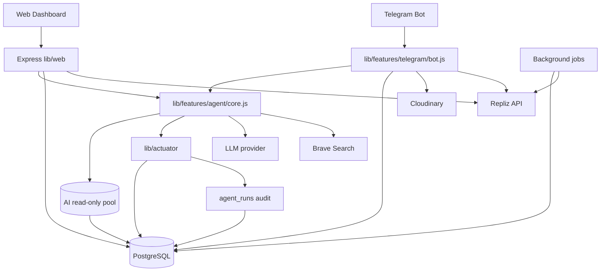

# CODEBASE WIKI — socai.my.id

Dokumentasi codebase untuk project `/var/www/socai.my.id` (**Batik Bakaran** — manajemen produk, pemasaran multi-channel, AI assistant, bounded autonomy, Repliz, dan bot Telegram).

**Terakhir diperbarui:** 26 Juni 2026  
**Repo:** https://github.com/iggbudi/socai.git

Dokumen terkait: `AGENTS.md` (instruksi coding agent), `README.md` (overview + diagram), `autonomous.md` (bounded autonomy), `evaluasi.md` (metrik penelitian), `logbook.md` (catatan pengembangan).

---

## 1. Ringkasan Eksekutif

`socai.my.id` adalah aplikasi Node.js ESM tanpa build step untuk mendukung UMKM Batik Bakaran dalam mengelola produk dan mengotomasi konten pemasaran. Sistem terdiri dari web dashboard, bot Telegram, AI agent berbasis tools, integrasi Repliz untuk scheduling/publishing, dan audit/evaluasi penelitian M1–M7.

| Aspek | Detail |
|---|---|
| Runtime | Node.js `>=24`, ESM, tanpa TypeScript/build step |
| Web | Express 5, session auth, inline HTML views, REST API, AI chat SSE |
| Bot | Telegraf long-polling, wizard produk/konten, ACL role-based |
| DB | PostgreSQL: `produk`, `pemasaran`, `users`, `user_sessions`, `agent_runs` |
| AI | `@earendil-works/pi-coding-agent`, tool `db_query`, `web_search`, actuator bounded |
| Social scheduling | Repliz, channel adapter `threads` + `instagram` |
| Media | Cloudinary opsional; fallback `/public/uploads/` lokal |
| Test | `npm test` (`node:test`) + `npm run test:ci` + smoke QA |
| Production | systemd: `socai-node.service`, `socai-bot.service`; web bind `127.0.0.1` |

---

## 2. Quick Start

```bash
cp .env.example .env      # isi kredensial dan origin production
npm start                 # web: default port 3010, bind 127.0.0.1
npm run bot               # bot Telegram long-polling
npm run dev               # web + bot di background
npm test                  # unit tests
npm run test:ci           # unit + qa-smoke tanpa HTTP
npm run eval:export       # export metrik penelitian M1–M7 JSON
```

Catatan:

- `validateWebEnvironment()` dipanggil saat web startup; `validateBotEnvironment()` saat bot startup.
- Di production, `APP_URL` dan `SESSION_SECRET` wajib benar agar CSRF/session stabil.
- Jika Repliz/Cloudinary tidak dikonfigurasi, fitur terkait harus gagal aman tanpa crash.

---

## 3. Peta Struktur Project

```text
.
├── server.js                         # Thin bootstrap web + shutdown
├── telegram-bot.js                   # Entry tipis → lib/features/telegram/bot.js (F8)
├── package.json                      # Scripts, deps, Node >=24
├── AGENTS.md                         # Instruksi agent project
├── README.md                         # Overview + diagram sistem
├── autonomous.md                     # Bounded autonomy & policy
├── evaluasi.md                       # Metrik penelitian M1–M7
├── CODEBASE_WIKI.md                  # Dokumen ini
├── scripts/                          # Export metrics + SQL helper
├── lib/
│   ├── shared/                        # Shared infra (F0/F1)
│   │   ├── db.js                      # pool + aiReadPool + closeAgentPools
│   │   ├── repliz.js                  # Repliz HTTP client
│   │   ├── wibTime.js                 # WIB eksplisit (+07:00)
│   │   ├── rateLimit.js               # Shared rate limiter
│   │   ├── mediaUrl.js                # Sanitasi URL gambar
│   │   ├── imageFile.js               # Magic-byte image validation
│   │   ├── html.js                    # escapeHtml
│   │   ├── telegramNotify.js          # Notifikasi Telegram
│   │   └── test/                      # Co-located tests (wibTime, mediaUrl)
│   ├── features/
│   │   ├── agent/                    # Fitur AI agent (F6): core, runner, runs, aiLimits, actuator/, autonomousJobs, approval, publishFeedback, routes (asisten + agent runs), view + test/
│   │   ├── channels/                 # Adapter channel social media (F2): registry, threads, instagram, prompt + test/
│   │   ├── auth/                       # Login/logout, session CSRF, rate limit (F3) + test/
│   │   ├── dashboard/                  # Dashboard page (F3)
│   │   ├── produk/                     # CRUD produk + upload (F4): routes, upload, view
│   │   ├── pemasaran/                  # Domain, routes, jobs, view + test (F5)
│   │   ├── evaluasi/                   # Metrik M1–M7 + route /api/agent/metrics + view + test (F7)
│   │   └── telegram/                   # Fitur bot (F8): bot.js (self-executing), helpers.js, access.js + test/
│   ├── env.js                        # Validasi env web/bot
│   ├── web/                            # Express app modular
├── public/uploads/                   # Upload gambar lokal
└── test/                             # node:test suites + qa-smoke.mjs
```

---

## 4. Arsitektur Runtime



Prinsip desain:

- **Shared core**: web dan bot memakai modul yang sama (`lib/shared/db.js` pools, `agent.js`, `lib/features/pemasaran/domain.js`, `actuator/`).
- **Bounded autonomy**: AI tidak bebas menulis DB; write path lewat actuator dan policy.
- **Defense in depth**: CSRF, CSP nonce, rate limit, ACL Telegram, upload validation, DB read-only AI.
- **Observability penelitian**: agent run/tool call dicatat untuk evaluasi M1–M7.

---

## 5. Web App (`server.js` + `lib/web/`)

`server.js` bertugas load `.env`, validasi environment, init schema, membuat app via `createWebApp()`, menjalankan background jobs, dan graceful shutdown.

| Modul | Fungsi |
|---|---|
| `createApp.js` | Express factory; session PG store; Helmet/CSP; mount routes |
| `lib/features/auth/` | Login/logout + session CSRF (`requireLogin`, `csrfToken`, `loginRateLimit`) |
| `lib/features/auth/routes.js` | Login/logout; `POST /logout` wajib `_csrf` |
| `middleware/csrf.js` | CSRF Origin/Referer untuk mutasi `/api/*` |
| `middleware/csp.js` | Nonce per request untuk inline script/style aman |
| `lib/features/auth/loginRateLimit.js` | Login throttling 5/15 menit per IP |
| `lib/features/produk/routes.js` | CRUD `/api/produk` + `/api/upload` (magic-byte, rename ext) |
| `lib/features/produk/upload.js` | Multer 5MB + filter MIME/ext |
| `middleware/csrf.js` | CSRF Origin/Referer untuk mutasi `/api/*` |
| `routes/pages.js` | Halaman `/dashboard`, `/produk`, `/pemasaran`, `/asisten`, `/evaluasi` |
| `routes/health.js` | `/health`, optional `?detail=1` |
| `routes/api/*` | Sisa API: channels, Repliz accounts |
| `views/*.js` | Template HTML inline; event harus via `addEventListener` ber-nonce |
| `lib/features/pemasaran/jobs.js` | Poll status Repliz dan auto-schedule plan pending |
---

## 6. Routes Web

### Pages

| Method | Path | Auth | Fungsi |
|---|---:|---:|---|
| GET | `/` | No | Redirect ke `/login` |
| GET/POST | `/login` | No | Login; POST rate-limited |
| GET | `/dashboard` | Yes | Ringkasan aplikasi |
| GET | `/produk` | Yes | UI CRUD produk |
| GET | `/pemasaran` | Yes | UI rencana pemasaran + Repliz |
| GET | `/asisten` | Yes | Chat AI SSE |
| GET | `/evaluasi` | Yes | Dashboard metrik M1–M7 |
| POST | `/logout` | Yes | Destroy session + agent; CSRF `_csrf` |
| GET | `/logout` | No | Redirect legacy ke `/dashboard` |
| GET | `/health` | No | Health JSON |

### API

Semua mutasi `/api/*` wajib lolos CSRF.

| Method | Path | Fungsi |
|---|---|---|
| POST | `/api/upload` | Upload gambar 5MB, magic-byte validated |
| GET/POST/PUT/DELETE | `/api/produk[/:id]` | CRUD produk |
| GET/POST/DELETE | `/api/pemasaran[/:id]` | CRUD rencana pemasaran |
| GET | `/api/channels` | Channel aktif/terkonfigurasi |
| GET | `/api/repliz/accounts` | Akun Repliz; filter `type`/`channel` |
| POST | `/api/pemasaran/repliz/schedule` | Bulk schedule |
| POST | `/api/pemasaran/:id/repliz/schedule` | Schedule satu plan |
| POST | `/api/pemasaran/:id/repliz/retry` | Retry schedule/publish gagal |
| POST | `/api/pemasaran/:id/repliz/sync` | Sync status Repliz |
| POST | `/api/asisten` | AI chat SSE, rate-limited |
| GET | `/api/agent/runs` | Audit rows agent_runs |
| GET | `/api/agent/metrics` | Metrik evaluasi M1–M7 |

---

## 7. AI Agent dan Bounded Autonomy

PostgreSQL pools ada di `lib/shared/db.js` (vertical slicing F0): `pool`, `aiReadPool`, `closeAgentPools()`. `lib/features/agent/core.js` mengekspos `agentSessions`, `initAgent()`, dan context audit run aktif.

Dependency: `@earendil-works/pi-coding-agent` **^0.83.0**. Sejak 0.83.0, API `AuthStorage`/`ModelRegistry` diganti `ModelRuntime`:
`ModelRuntime.create({ allowModelNetwork: false })` (credentials dari `auth.json` + env `XIAOMI_API_KEY` dll), resolve model via `modelRuntime.getModel(provider, modelId)`, dan diteruskan ke `createAgentSession({ modelRuntime, ... })`.

| Tool | Peran | Guardrail |
|---|---|---|
| `db_query` | Baca data `produk`/`pemasaran` | SELECT-only, single table, no JOIN, no multi statement, max 50 rows |
| `web_search` | Riset tren via Brave | Aktif hanya jika `BRAVE_API_KEY` tersedia |
| `get_calendar_gaps` | Cari slot jadwal kosong | Read-only calendar helper |
| `save_content_plan` | Simpan draft/rencana konten | Policy actuator + cap per run |
| `schedule_content` | Jadwalkan ke Repliz | `AUTONOMY_MODE`, approval, daily cap |
| `sync_content_status` | Refresh status publikasi | Update status terkontrol |

Mode autonomy: `assistive` (default aman), `supervised` (human-in-loop), `bounded` (aksi dalam batas policy/cap). Config global `AUTONOMY_MODE`; override web/bot/cron tersedia.

Audit: `lib/features/agent/runs.js` mencatat run/tool/plans/error/durasi; `lib/features/evaluasi/metrics.js` menghitung M1–M7; export via `scripts/export-evaluation.mjs`.

---

## 8. Pemasaran, Channel, dan Repliz

`lib/features/pemasaran/domain.js` adalah shared business logic untuk web + bot: `savePlansToDb()`, `schedulePlanToChannel()`, alias `schedulePlanToRepliz()`, `syncPlanReplizStatus()`, dan `parseMarketingSchedule()`.

| Komponen | Peran |
|---|---|
| `lib/features/channels/registry.js` | Register/list channel berdasarkan `ENABLED_CHANNELS` |
| `lib/features/channels/threads.js` | Adapter Threads via Repliz account utama |
| `lib/features/channels/instagram.js` | Adapter Instagram via `REPLIZ_INSTAGRAM_ACCOUNT_ID` |
| `lib/features/channels/prompt.js` | Prompt section channel untuk AI |
| `lib/shared/repliz.js` | HTTP client Repliz |
| `lib/features/pemasaran/jobs.js` | Background sync dan auto-schedule |

Repliz menggunakan `REPLIZ_API_KEY`, `REPLIZ_SECRET`, `REPLIZ_ACCOUNT_ID`, `REPLIZ_BASE_URL`; Instagram butuh `ENABLED_CHANNELS=instagram` dan `REPLIZ_INSTAGRAM_ACCOUNT_ID`. Unique index `repliz_schedule_id` mencegah double schedule.

---

## 9. Bot Telegram

Entry point: `telegram-bot.js` (thin); logika: `lib/features/telegram/bot.js`; ACL: `lib/features/telegram/access.js`; user store: `telegram-users.json`.

| Role | Kemampuan |
|---|---|
| `super_admin` | Semua command, kelola user, mutasi/delete konten |
| `operator` | AI chat, wizard produk/konten, Repliz schedule/post/sync |
| `viewer` | Read-only status, produk, kalender, status konten |
| Semua | `/start`, `/help`, `/whoami`, `/batal` |

Command penting: `/status`, `/listproduk`, `/jadwalkonten`, `/statuskonten`, `/tambahproduk`, `/buatkonten`, `/jadwalkan`, `/postnow`, `/retrypost`, `/cekpost`, `/ubahstatuskonten`, `/hapuskonten`, `/adduser`, `/removeuser`, `/listusers`. Free text untuk operator masuk AI chat; photo dipakai wizard gambar (Cloudinary atau local upload).

---

## 10. Database Schema Ringkas

```sql
-- users: id, username, password (bcrypt)
-- produk: id, nama, harga, stok, gambar, deskripsi, created_at, updated_at
-- pemasaran: id, judul, strategi, target_audiens, kanal, jadwal, copywriting,
--   produk_terkait, created_at, gambar, status, scheduled_at, published_at,
--   external_post_id, external_status, last_error, repliz_schedule_id,
--   repliz_status, repliz_scheduled_at, repliz_last_error, repliz_synced_at,
--   repliz_attempts, auto_schedule_enabled
-- user_sessions: managed by connect-pg-simple
-- agent_runs: run_id, session_key, source, autonomy_mode, trigger_type,
--   user_prompt, status, model_ref, tools_called, plans_saved,
--   plans_scheduled, pemasaran_ids, error_message, started_at, ended_at, duration_ms
```

---

## 11. Environment Variable Penting

| Kategori | Variable |
|---|---|
| Core | `NODE_ENV`, `PORT`, `APP_URL`, `SESSION_SECRET` |
| DB | `DB_*`, `DB_AI_READ_*` |
| AI | `AI_MODEL`, `AI_MODEL_FALLBACKS`, `TELEGRAM_AI_MODEL*`, `XIAOMI_*`, `BRAVE_API_KEY` |
| Rate limit | `AI_MESSAGE_MAX_LENGTH`, `WEB_AI_RATE_LIMIT`, `TELEGRAM_AI_RATE_LIMIT`, `*_RATE_WINDOW_MS` |
| Autonomy | `AUTONOMY_MODE`, `WEB_AUTONOMY_MODE`, `TELEGRAM_AUTONOMY_MODE`, `REQUIRE_APPROVAL`, `MAX_AGENT_*` |
| Repliz/channel | `ENABLED_CHANNELS`, `REPLIZ_*`, `REPLIZ_INSTAGRAM_ACCOUNT_ID` |
| Telegram | `TELEGRAM_BOT_TOKEN`/aliases, `TELEGRAM_SUPER_ADMIN_ID`, `TELEGRAM_APPROVAL_NOTIFY_ROLES` |
| Media | `ALLOWED_IMAGE_HOSTS`, `CLOUDINARY_*` |
| Jobs | `AUTO_PLAN_*`, `AGENT_RUNS_*` |

---

## 12. Security Checklist

- CSRF pada mutasi `/api/*` dan `POST /logout` — origin check hanya `APP_URL` + localhost (A6: tidak percaya `Host`/`X-Forwarded-*` dari client; `trust proxy: 'loopback'`).
- CSP Helmet + nonce; jangan tambah `onclick`, `onchange`, inline style bebas, atau script tanpa nonce.
- **Views (A5)**: data dinamis/error message tidak boleh masuk `innerHTML` — pakai `textContent` atau `esc()`; qa-smoke memvalidasi pola ini.
- Upload: multer filter awal + `assertValidImageBuffer()` magic-byte.
- Gambar eksternal harus lewat `sanitizeImageUrl()`.
- AI DB gunakan `aiReadPool`; query SELECT-only dan sandboxed.
- Rate limit login, web AI, Telegram AI.
- Command Telegram mutasi wajib cek role minimum.
- Jangan commit `.env`, token bot, key Repliz, secret Cloudinary.
- Production wajib HTTPS reverse proxy agar cookie `secure` benar.

---

## 13. Testing dan QA

```bash
npm test
npm run test:ci
node --check server.js
node --check telegram-bot.js
```

Suite utama mencakup sanitasi media, magic-byte image, AI limits, rate limit, pemasaran/Repliz, channel registry, actuator policy, approval flow, agent runs, evaluation metrics, CSRF token, Telegram ACL, autonomous jobs, dan QA smoke CSP/nonce.

---

## 14. Gotcha dan Konvensi Kontribusi

- Gunakan `rtk` saat menjalankan command shell sesuai instruksi project.
- Node `>=24` wajib; jangan menambahkan build step tanpa alasan kuat.
- Web hanya listen `127.0.0.1`; expose via reverse proxy.
- `index.html` root hanya placeholder, bukan entry point Express.
- UI berada di `lib/web/views/`; event binding harus via `addEventListener` di script nonce.
- Jangan membuat logic pemasaran ganda di web/bot; taruh di `lib/features/pemasaran/domain.js` atau `lib/features/agent/actuator/`.
- Untuk channel baru, tambahkan adapter di `lib/features/channels/` dan update prompt/registry/test.
- Untuk write action AI baru, wajib lewat actuator + policy + audit log.
- Tambahkan/ubah test saat mengubah security, scheduler, channel, AI tools, atau schema.

---

## 15. Runbook Operasional Singkat

1. Pastikan `.env` production lengkap (`NODE_ENV=production`, `APP_URL`, `SESSION_SECRET`, DB, bot token).
2. Jalankan startup app agar schema init berjalan; pastikan PostgreSQL dapat diakses.
3. Setup reverse proxy HTTPS ke `127.0.0.1:3010`.
4. Jalankan systemd `socai-node.service` dan `socai-bot.service`.
5. Cek `GET /health?detail=1`.
6. Cek login web, upload gambar, CRUD produk, CRUD pemasaran.
7. Jika Repliz aktif, cek `/api/channels` dan `/api/repliz/accounts`.
8. Cek Telegram `/whoami`, `/status`, command sesuai role.
9. Monitor `agent_runs`, Repliz errors, dan storage `public/uploads/`.

---

## 16. Roadmap Maintenance

- Jaga dokumentasi `CODEBASE_WIKI.md`, `AGENTS.md`, `README.md`, `autonomous.md`, dan `evaluasi.md` tetap sinkron.
- Pertimbangkan migration runner eksplisit jika schema makin kompleks.
- Pertimbangkan memecah `lib/features/telegram/bot.js` (commands/ + wizards/) setelah ada test harness bot (risiko runtime tanpa test).
- Tambahkan adapter channel baru melalui pola `lib/features/channels/*` + tests.
- Perluas metrics dashboard bila kebutuhan penelitian bertambah.

---

## 17. Changelog — Sprint Remediasi (1 Agustus 2026)

Rencana & status: `sprint-plan.md` · catatan sesi: `logbook.md` (Sesi 1 Agustus 2026).

| Sprint | Commit | Ringkasan |
|--------|--------|-----------|
| S0 | `6e10946` `cd43a3a` | Plan `sprint-plan.md`; fix CI blocker A9 (lockfile URL mirror Tencent → registry.npmjs.org) |
| S1 | `167c35b` | A1: `POST /login` tanpa body → tidak lagi 500 (`req.body || {}`); A2: pesan rate-limit Telegram benar (`retryAfterMs/1000`); `test/routes.test.js` pertama; `agent.js` interval cleanup di-`unref()` |
| S2 | `ee2c981` | A3: `pi-coding-agent` 0.79.6→0.83.0 (undici 8.5.0, ws 8.21.0), express 5.2.1, multer 2.2.0, override `brace-expansion: 5.0.9` → `npm audit` 0 vuln; adaptasi API `AuthStorage/ModelRegistry` → `ModelRuntime` |
| S3 | `edc5bb1` | A4: `lib/wibTime.js` (WIB eksplisit +07:00), `parseMarketingSchedule` & `getCalendarGaps` konsisten WIB; `deploy/` unit systemd + runbook (TZ=Asia/Jakarta) |
| S4 | `66b24ce` | A5: `innerHTML` dinamis → `textContent`/`esc()` di asisten/evaluasi/produk; qa-smoke pattern check XSS |
| S5 | `10d8f8d` | A6: CSRF origin check hanya `APP_URL`+localhost (tolak spoof Host/X-Forwarded-*); `trust proxy: 'loopback'`; `test/csrfMiddleware.test.js` |
| S6 | `543cd32` | A7: route-level tests 2→9 (health shape, auth guard 401, logout, CSRF e2e, redirect) — 103/103 test |
| S7 | `67305d1` | Finalisasi docs (changelog, retrospective), regression penuh, tag `v1.1.0` |
| S8 | `ea6f555` | Vertical slicing F0: `pool`/`aiReadPool`/`closeAgentPools()` diekstrak `lib/agent.js` → `lib/shared/db.js`; 11 importer diupdate (web, bot, agentRunner, autonomousJobs) — tanpa perubahan behavior |
| S9 | `dd6f002` | Vertical slicing F1: 7 modul shared (`wibTime`, `rateLimit`, `mediaUrl`, `imageFile`, `html`, `repliz`, `telegramNotify`) → `lib/shared/`; ±20 importer diupdate; co-located test `lib/shared/test/`; glob `npm test` + qa-smoke path diupdate |
| S10 | `4c1b516` | Vertical slicing F2: fitur `channels` (5 file) → `lib/features/channels/`; 11 importer diupdate; `env.js` pengecualian terdokumentasi (CHANNEL_IDS); co-located test + glob `npm test` + qa-smoke diupdate |
| S11 | `318a3be` | Vertical slicing F3: fitur `auth` (requireLogin, csrfToken, loginRateLimit, routes, view, test) + `dashboard` → `lib/features/`; `layout`/`pageInit` → `lib/shared/`; 7 route API + createApp + pages + qa-smoke diupdate |
| S12 | `6b803f6` | Vertical slicing F4: fitur `produk` (CRUD + upload, 2 route digabung) → `lib/features/produk/`; createApp/pages/qa-smoke diupdate |
| S13 | `5c2e04f` | Vertical slicing F5: fitur `pemasaran` (domain 297 baris + routes + jobs + view + test) → `lib/features/pemasaran/`; 10 importer diupdate; `lib/web/replizJobs.js` dihapus |
| S14 | `b6a5e78` | Vertical slicing F6: fitur `agent` (12 modul + 2 route API digabung + view) → `lib/features/agent/`; 6 test co-located; createApp/server/telegram-bot/health/qa-smoke diupdate |
| S15 | `74381e4` | Vertical slicing F7: fitur `evaluasi` (metrics + route `/api/agent/metrics` dipisah + view + test) → `lib/features/evaluasi/`; `health` → `lib/web/health.js`; fix bug laten import `listAgentRuns` di agent routes |
| S16 | `28b3e78` | Vertical slicing F8: fitur `telegram` (access + helpers co-located; bot.js utuh dari monolit 1.364 baris; entry root tipis) → `lib/features/telegram/` |
