# socai — Autonomous AI Agent untuk Otomasi Konten Media Sosial

Sistem manajemen produk dan otomasi konten **Threads** untuk UMKM **Batik Bakaran**, dibangun sebagai implementasi penelitian *Autonomous AI Agent untuk Otomasi Konten Media Sosial*.

Aplikasi menggabungkan **web dashboard**, **bot Telegram**, **AI agent berbasis tool**, dan integrasi **Repliz** untuk penjadwalan/publikasi konten.

| Komponen | URL / Akses |
|----------|-------------|
| Web app | `https://socai.my.id` |
| Repository | `https://github.com/iggbudi/socai` |
| Runtime | Node.js ≥ 24, PostgreSQL |

---

## Fitur Utama

- **Manajemen produk** — CRUD produk, upload gambar (magic-byte validation)
- **Perencanaan pemasaran** — rencana konten Threads, kalender, status
- **Asisten AI** — chat SSE di web & Telegram; tools `db_query` (read-only), `web_search`, dan actuator terkontrol (`save_content_plan`, `schedule_content`, …)
- **Bounded autonomy (P1)** — `AUTONOMY_MODE`, actuator `lib/actuator/`, audit log `agent_runs`
- **Otomasi Repliz** — jadwalkan, post now, retry, sync status, auto-schedule background
- **Bot Telegram** — wizard konten/produk, role-based ACL (`super_admin` / `operator` / `viewer`)
- **Keamanan** — CSRF, CSP nonce, rate limit, Helmet, DB read-only untuk AI

---

## Tech Stack

| Lapisan | Teknologi |
|---------|-----------|
| Runtime | Node.js 24+ (ESM) |
| Web | Express 5, session (`connect-pg-simple`), Helmet |
| Bot | Telegraf (long-polling) |
| Database | PostgreSQL |
| AI | `@earendil-works/pi-coding-agent`, Xiaomi MiMo / fallback |
| Scheduling | Repliz API (Threads) |
| Media | Cloudinary (opsional), `/uploads/` lokal |
| Test | `node:test` + `node:assert` |

---

## Struktur Proyek

```text
socai/
├── server.js              # Bootstrap web + Repliz background jobs
├── telegram-bot.js        # Entry point bot Telegram
├── lib/
│   ├── agent.js           # AI agent, db_query, web_search, connection pools
│   ├── pemasaran.js       # Logik shared pemasaran & Repliz
│   ├── repliz.js          # HTTP client Repliz
│   ├── telegramAccess.js  # Role-based ACL bot
│   ├── csrfToken.js       # CSRF session token
│   ├── health.js          # Health check
│   └── web/               # Modul web (refactor Sprint 3)
│       ├── createApp.js   # Factory Express
│       ├── middleware/    # auth, csrf, csp, rate limit, upload
│       ├── routes/        # pages, auth, health, api/*
│       ├── views/         # HTML templates (nonce CSP)
│       └── replizJobs.js  # Auto sync & auto schedule
├── test/                  # Unit & smoke tests
├── public/uploads/        # Gambar upload lokal
├── telegram-users.json    # Allowlist & role bot
├── scripts/               # SQL setup (mis. read-only user)
├── AGENTS.md              # Panduan untuk coding agent
└── logbook.md             # Catatan pengembangan per sesi
```

---

## Arsitektur Sistem

### Gambaran Umum

Sistem berlapis **presentation → application → AI agent → actuator → data → external services**. Siklus penelitian: **Perceive → Plan → Act → Evaluate**.

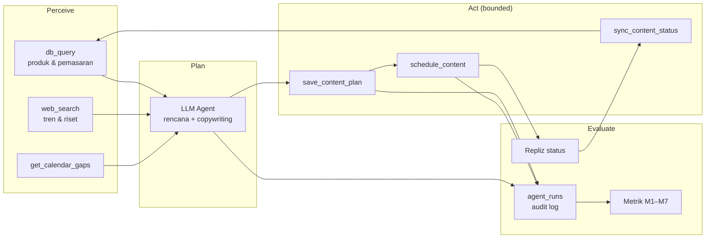

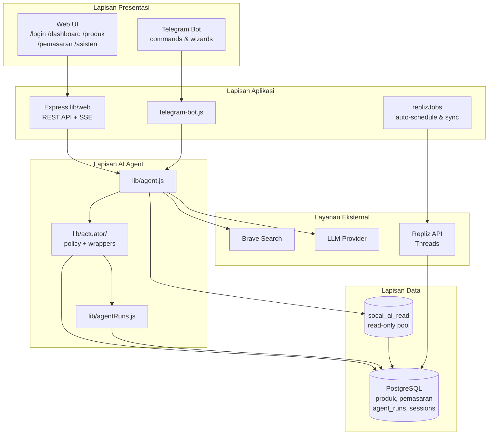

### Prinsip Arsitektur

| Prinsip | Implementasi |
|---------|--------------|
| **Bounded autonomy** | `db_query` SELECT-only; write via actuator + `AUTONOMY_MODE` (`assistive` / `supervised` / `bounded`) |
| **Shared core** | `lib/agent.js`, `lib/pemasaran.js`, `lib/actuator/` dipakai web & bot |
| **Defense in depth** | CSRF, CSP nonce, rate limit, role ACL, URL whitelist, policy caps |
| **Observability** | Setiap agent run & tool call tercatat di `agent_runs` |
| **Human-in-the-loop** | Default `assistive`; supervised/bounded untuk skenario penelitian |

---

## Diagram UML & DAD

Bagian ini mendokumentasikan model sistem sesuai standar dokumentasi perangkat lunak (UML + Diagram Alur Data).

### 1. Use Case Diagram

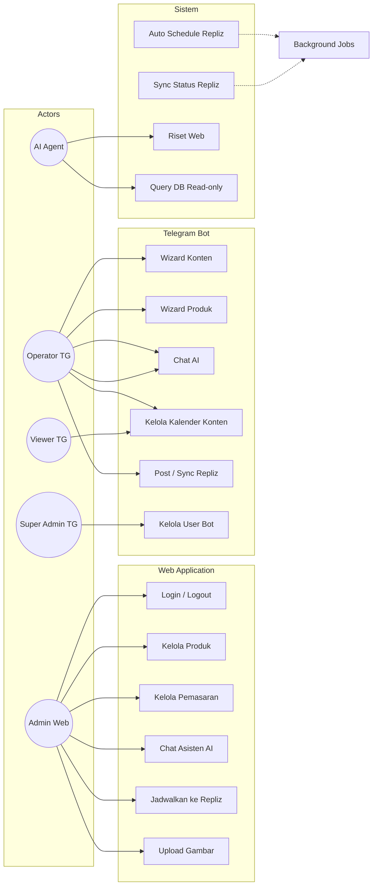

### 2. Activity Diagram — Alur Otomasi Konten

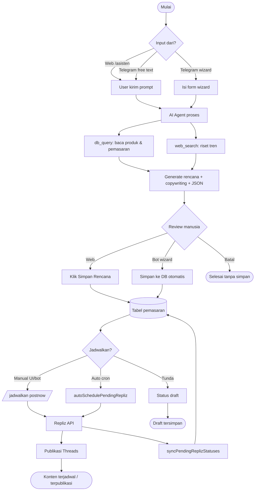

### 3. Sequence Diagram — Chat Asisten Web (SSE)

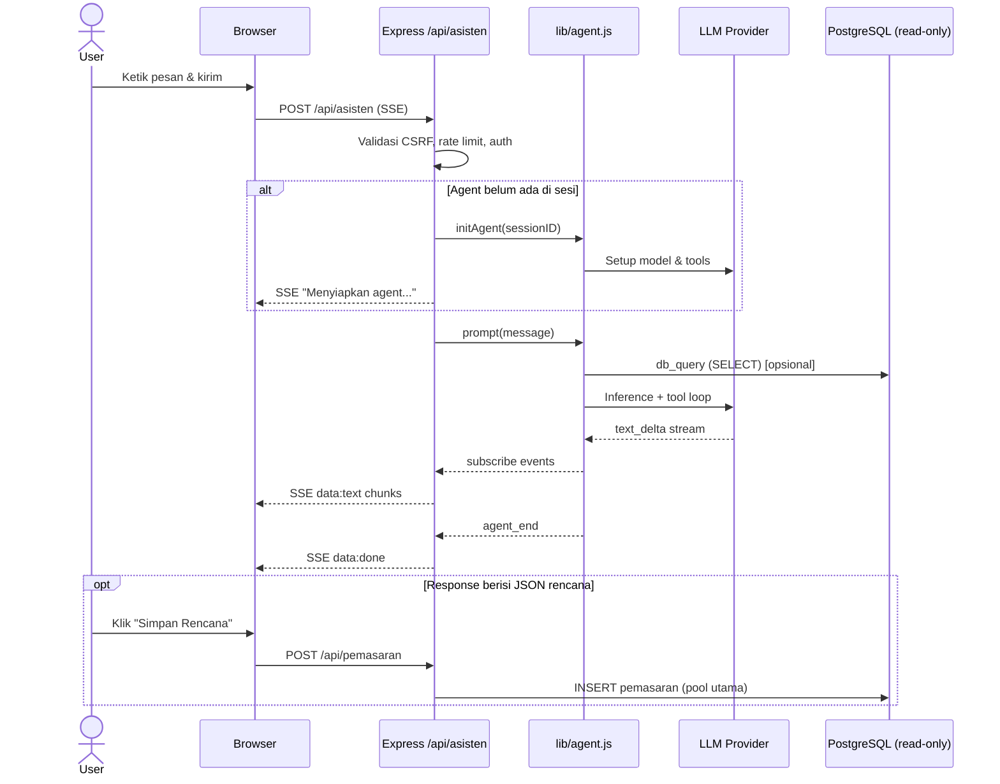

### 4. Sequence Diagram — Penjadwalan Repliz

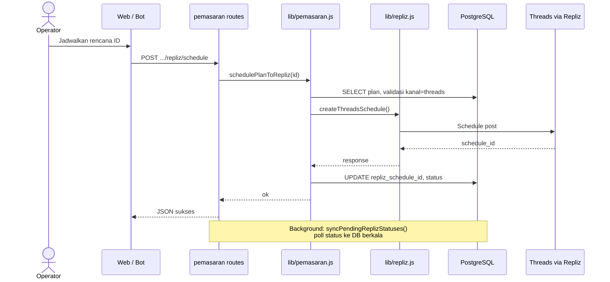

### 5. Class Diagram — Model Domain (tersederhanakan)

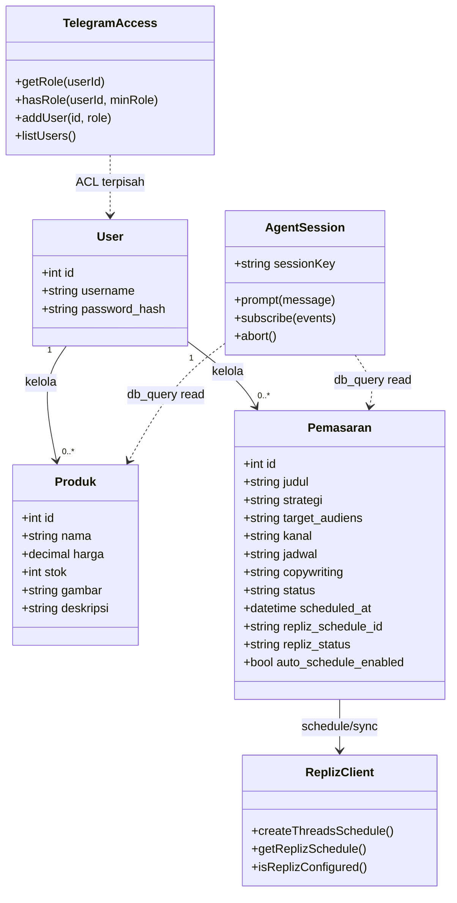

### 6. Component Diagram

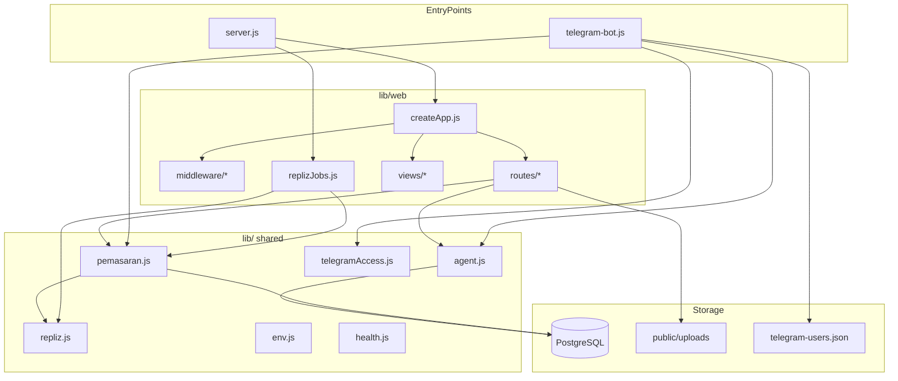

### 7. Deployment Diagram

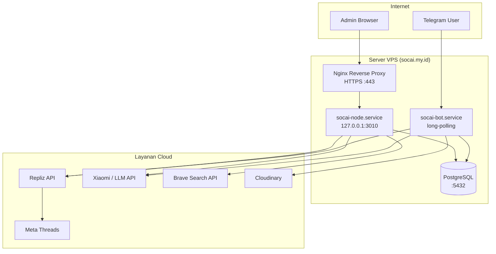

### 8. State Diagram — Status Rencana Pemasaran / Repliz

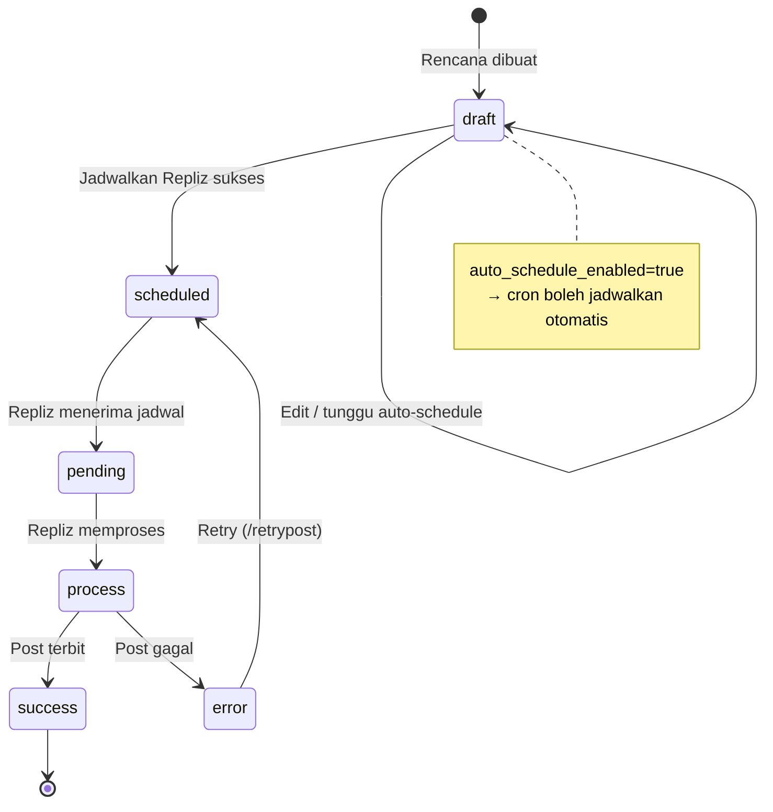

### 9. DAD — Diagram Alur Data

**DAD Level 0 (Diagram Konteks)** — interaksi sistem dengan entitas luar:

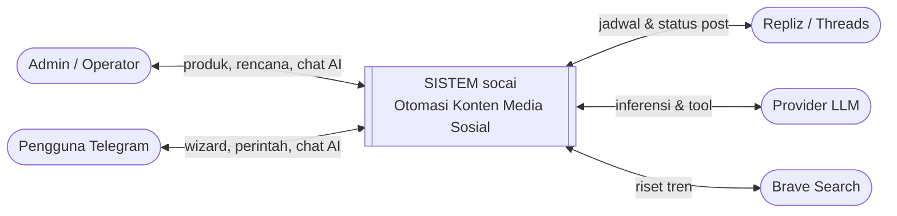

**DAD Level 1** — proses utama di dalam sistem:

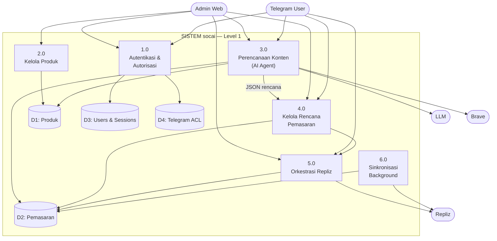

| Proses DAD | Deskripsi | Data Store |
|------------|-----------|------------|
| 1.0 Autentikasi | Login web, session, role Telegram | D3, D4 |
| 2.0 Kelola Produk | CRUD produk & upload gambar | D1 |
| 3.0 Perencanaan AI | Chat, db_query, web_search, generate JSON | D1, D2 (baca) |
| 4.0 Kelola Rencana | Simpan, ubah status, hapus rencana | D2 |
| 5.0 Orkestrasi Repliz | Schedule, post now, retry | D2 ↔ Repliz |
| 6.0 Sinkronisasi | Auto schedule & sync status | D2 ↔ Repliz |

---

## Keamanan

| Mekanisme | Cakupan |
|-----------|---------|
| Session + bcrypt | Login web |
| CSRF Origin/Referer | Semua mutasi `/api/*` |
| CSRF token | `POST /logout` |
| CSP nonce | Inline script/style di views |
| `script-src-attr 'none'` | Event via `addEventListener` |
| Rate limit | Login, AI web, AI Telegram |
| `socai_ai_read` | AI `db_query` SELECT-only |
| Role ACL | Telegram `super_admin` / `operator` / `viewer` |
| URL whitelist | Gambar eksternal (`sanitizeImageUrl`) |

---

## Persiapan & Menjalankan

### Prasyarat

- Node.js ≥ 24
- PostgreSQL
- (Opsional) Akun Repliz, Cloudinary, Brave, Xiaomi API

### Instalasi

```bash
git clone https://github.com/iggbudi/socai.git
cd socai
cp .env.example .env
# Edit .env — isi DB, SESSION_SECRET, APP_URL, token bot, API keys
npm install
```

### Setup database read-only (disarankan)

```bash
psql -U postgres -d socai -f scripts/setup-ai-readonly.sql
# Set DB_AI_READ_USER & DB_AI_READ_PASSWORD di .env
```

### Menjalankan

```bash
npm start          # Web — http://127.0.0.1:3010
npm run bot        # Telegram bot
npm run dev        # Keduanya (development)
npm test           # Unit tests (32 tests)
node test/qa-smoke.mjs   # Smoke test CSP & HTTP
```

### Production (systemd)

```bash
sudo systemctl start socai-node socai-bot
sudo systemctl status socai-node socai-bot
```

Web bind `127.0.0.1` — wajib reverse proxy (Nginx) + `APP_URL=https://socai.my.id`.

---

## Variabel Lingkungan Penting

Lihat `.env.example` untuk daftar lengkap. Ringkasan:

| Variabel | Fungsi |
|----------|--------|
| `DB_*` | Koneksi PostgreSQL utama |
| `DB_AI_READ_*` | Pool read-only untuk AI |
| `SESSION_SECRET`, `APP_URL` | Session & CSRF production |
| `AI_MODEL`, `TELEGRAM_AI_MODEL` | Model LLM (format `provider/model-id`) |
| `XIAOMI_API_KEY` | Provider Xiaomi MiMo |
| `BRAVE_API_KEY` | Tool `web_search` |
| `TELEGRAM_BOT_TOKEN` | Token bot |
| `TELEGRAM_SUPER_ADMIN_ID` | Super admin bot |
| `REPLIZ_*` | Integrasi Threads scheduling |
| `CLOUDINARY_*` | Upload gambar dari Telegram |

---

## Konteks Penelitian

Sistem ini mengimplementasikan **AI agent terkendali** (*bounded autonomy*) untuk UMKM:

- **Perceive:** baca produk & kalender konten (`db_query`), riset tren (`web_search`)
- **Plan:** generate rencana 7 hari + copywriting Threads (JSON terstruktur)
- **Act (terbatas):** simpan & publish melalui actuator (UI, bot, cron Repliz) dengan pengawasan operator

Tingkat autonomi penuh end-to-end menjadi ruang pengembangan lanjutan (lihat `logbook.md`).

---

## Dokumentasi Lain

| File | Isi |
|------|-----|
| [AGENTS.md](AGENTS.md) | Panduan teknis untuk AI coding agent |
| [logbook.md](logbook.md) | Log pengembangan per sesi |
| [CODEBASE_WIKI.md](CODEBASE_WIKI.md) | Wiki codebase (sebagian perlu di-update pasca refactor) |

---

## Lisensi

Proyek privat (`"private": true` di `package.json`). Hak cipta penelitian — Batik Bakaran / socai.my.id.