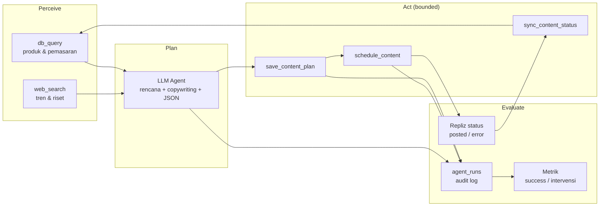
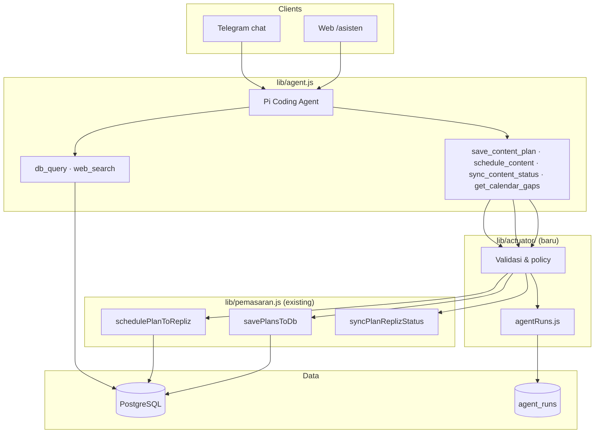

# autonomous.md — Rencana Bounded Autonomous Agent

**Status:** P1 ✅ implemented (`75560a5`) · P2 ✅ implemented  
**Tanggal:** 17 Juni 2026  
**Proyek:** socai.my.id — Batik Bakaran  
**Judul penelitian:** *Autonomous AI Agent untuk Otomasi Konten Media Sosial*

Dokumen ini menjadi **sumber tunggal** untuk:
1. **Bab III Metodologi Penelitian** (draft siap disalin ke skripsi)
2. **Backlog implementasi P1** — actuator tools + instrumentasi `agent_runs`

Referensi codebase: `lib/agent.js`, `lib/pemasaran.js`, `lib/web/replizJobs.js`, `telegram-bot.js`, `logbook.md`, `README.md`.

---

## 1. Ringkasan rencana

### Masalah

Sistem saat ini ~60–70% sesuai judul penelitian: agent kuat di **perceive + plan**, lemah di **act** otonom (human-in-the-loop untuk simpan/jadwal).

### Solusi P1 (tanpa mengorbankan keamanan)

Tetap pertahankan **`db_query` read-only**. Naikkan autonomi lewat:

| Komponen | Fungsi |
|---|---|
| **Actuator tools** | Tool AI terkontrol yang memanggil `savePlansToDb`, `schedulePlanToRepliz`, dll. — bukan SQL bebas |
| **`agent_runs`** | Log setiap eksekusi agent + tool + outcome untuk evaluasi penelitian |
| **`AUTONOMY_MODE`** | Konfigurasi tingkat autonomi per sesi/kanal |

P1 **belum** menyentuh cron mingguan penuh (itu P2). P1 fokus fondasi: **agent bisa act terkontrol + semua keputusan tercatat**.

### Definisi autonomi penelitian

| Mode | Perceive | Plan | Act (save) | Act (schedule) | Human gate |
|---|---|---|---|---|---|
| `assistive` | ✅ | ✅ | ❌ | ❌ | User simpan/jadwal manual |
| `supervised` | ✅ | ✅ | ✅ tool | ❌ / manual | Notifikasi setelah save |
| `bounded` | ✅ | ✅ | ✅ tool | ✅ tool (jika policy lolos) | Approve opsional via Telegram |

**Klaim skripsi:** *bounded autonomous* — agent menjalankan pipeline terbatas dengan audit trail, bukan zero-human.

---

## 2. BAB III — Metodologi Penelitian (draft)

> Bagian ini bisa disalin ke skripsi dengan penyesuaian format kampus (nomor sub-bab, kutipan, dll.).

### 3.1 Jenis dan pendekatan penelitian

Penelitian ini bersifat **rekayasa perangkat lunak berbasis studi kasus** (*design science / action research*) pada UMKM Batik Bakaran. Tujuan utamanya membangun dan mengevaluasi sistem **AI agent terkendali** (*bounded autonomous agent*) untuk otomasi perencanaan dan orkestrasi konten media sosial (pilot: **Threads** via Repliz API).

Pendekatan:
- **Studi kasus tunggal** — satu UMKM, satu kanal pilot, data produk & kalender konten nyata.
- **Iteratif** — baseline assistive (kondisi awal) → P1 supervised/bounded → evaluasi metrik.
- **Evaluatif** — keberhasilan diukur kuantitatif (metrik operasional) dan kualitatif (feedback operator).

### 3.2 Objek, lokasi, dan batasan

| Aspek | Keterangan |
|---|---|
| Objek | Sistem socai.my.id (web + Telegram bot + AI agent) |
| Subjek pengujian | Operator/super admin UMKM (human-in-the-loop) |
| Kanal media sosial | Threads (scheduling via Repliz) — pilot *media sosial* |
| Data | Tabel `produk`, `pemasaran`; log `agent_runs` |
| Batasan | Agent tidak menulis DB via SQL bebas; act hanya lewat actuator |
| Autonomi penuh tanpa pengawasan | **Di luar scope** — disengaja untuk keamanan UMKM |

### 3.3 Kerangka konseptual: Perceive → Plan → Act → Evaluate



**Perceive:** agent membaca state bisnis (stok, harga, kalender konten) dan konteks eksternal (tren).

**Plan:** agent menghasilkan rencana terstruktur (JSON) dengan aturan anti-duplikasi jadwal.

**Act:** actuator mengeksekusi operasi bisnis yang sudah divalidasi (simpan draft, jadwalkan Repliz).

**Evaluate:** setiap langkah dicatat di `agent_runs`; outcome publish disinkronkan untuk analisis.

### 3.4 Arsitektur bounded autonomy

Prinsip yang dipertahankan dari codebase existing:

1. **Separation of concerns** — reasoning (LLM) terpisah dari side-effect (actuator).
2. **Least privilege** — `aiReadPool` untuk baca; `pool` untuk write hanya via fungsi teraudit.
3. **Defense in depth** — validasi input, rate limit, role ACL, URL whitelist, CSRF (web).
4. **Observability** — `agent_runs` sebagai bukti empiris untuk penelitian.



### 3.5 Variabel penelitian

#### Variabel bebas
- **Tingkat autonomi** (`AUTONOMY_MODE`: `assistive` | `supervised` | `bounded`)
- **Trigger** (manual chat vs perintah eksplisit vs nanti cron P2)

#### Variabel terikat (metrik)

| ID | Metrik | Rumus / sumber |
|---|---|---|
| M1 | **Planning success rate** | rencana valid tersimpan / total percobaan save |
| M2 | **Schedule success rate** | Repliz schedule sukses / total percobaan schedule |
| M3 | **Human intervention count** | jumlah aksi manual (klik UI, `/jadwalkan`) per periode |
| M4 | **Time-to-publish** | median `published_at - agent_run.started_at` |
| M5 | **Tool error rate** | run dengan `status=error` / total run |
| M6 | **Calendar coverage** | % slot mingguan terisi tanpa duplikasi jadwal |
| M7 | **Publish outcome** | % posted vs failed (dari `repliz_status`) |

#### Variabel kontrol
- Model AI (`AI_MODEL`, `TELEGRAM_AI_MODEL`)
- Rate limit (`WEB_AI_RATE_LIMIT`, `TELEGRAM_AI_RATE_LIMIT`)
- Konfigurasi Repliz (`REPLIZ_*`)
- Dataset produk & baseline kalender pemasaran

### 3.6 Prosedur pengumpulan data

1. **Baseline (pre-P1):** catat manual 1–2 minggu operasi assistive — intervensi manusia, waktu kerja.
2. **Implementasi P1:** deploy actuator + `agent_runs`.
3. **Skenario uji terkontrol** (lihat §3.7): minimal 3×7 hari rencana per mode autonomi.
4. **Ekspor data:** query `agent_runs` + join `pemasaran` untuk analisis.
5. **Wawancara singkat operator:** kepuasan, kepercayaan, koreksi yang masih diperlukan.

### 3.7 Skenario pengujian

| Skenario | Mode | Trigger | Ekspektasi |
|---|---|---|---|
| S1 | `assistive` | Chat: "buat rencana 7 hari" | JSON di chat; **tidak** auto-save; M3 tinggi |
| S2 | `supervised` | Chat + instruksi simpan | Agent panggil `save_content_plan`; schedule manual; M1 diukur |
| S3 | `bounded` | Chat: "buat dan jadwalkan minggu depan" | save + schedule via tool; M2, M4 diukur |
| S4 | `bounded` | Duplikasi jadwal sengaja | Tool tolak; error tercatat di `agent_runs` |
| S5 | Semua | Repliz tidak dikonfigurasi | schedule gagal graceful; tidak crash |
| S6 | `bounded` | `REQUIRE_APPROVAL=true` | save OK; schedule menunggu approve (hook P2) |

**Kriteria lulus P1:**
- S2–S5 lulus otomatis (`npm test` + skenario manual terdokumentasi)
- 100% tool invocation tercatat di `agent_runs`
- Tidak ada regresi keamanan (read-only `db_query` tetap)

### 3.8 Alat dan bahan

| Kategori | Alat |
|---|---|
| Bahasa / runtime | Node.js ≥24, ESM |
| Framework | Express 5, Telegraf, `@earendil-works/pi-coding-agent` |
| Database | PostgreSQL 16+ |
| AI | Xiaomi MiMo (konfigurasi existing) |
| Riset | Brave Search API (`web_search`) |
| Publish | Repliz API (Threads) |
| Testing | `node:test`, `test/qa-smoke.mjs` |
| Observability | Tabel `agent_runs`, log aplikasi |

### 3.9 Teknik analisis data

- **Deskriptif:** mean/median M1–M7 per mode autonomi.
- **Komparatif:** assistive vs supervised vs bounded (uji Wilcoxon / Mann-Whitney jika n kecil).
- **Kualitatif tematik:** feedback operator terhadap konten auto-generated.
- **Keamanan:** audit sample `agent_runs.payload` — tidak ada secret, tidak ada SQL mentah dari LLM.

---

## 3. Gap analysis — kondisi vs target P1

| Area | Sekarang | Target P1 |
|---|---|---|
| Agent tools | `db_query`, `web_search` | + 4 actuator tools |
| Write path | UI, bot callback, API | + agent actuator (shared `pemasaran.js`) |
| Logging penelitian | `console.log` | `agent_runs` terstruktur |
| Autonomy config | implisit / human default | `AUTONOMY_MODE` eksplisit |
| Evaluasi | ad-hoc (`logbook.md`) | metrik M1–M7 terdefinisi |
| Tests | 32 unit tests | + tests actuator & agentRuns |

---

## 4. Desain teknis P1

### 4.1 Schema database: `agent_runs`

Migrasi baru (bootstrap di `server.js` atau `lib/agentRuns.js`):

```sql
CREATE TABLE IF NOT EXISTS agent_runs (
  id              bigserial PRIMARY KEY,
  run_id          uuid NOT NULL DEFAULT gen_random_uuid(),
  session_key     text NOT NULL,          -- sessionID web atau telegram:{chatId}
  source          text NOT NULL,          -- 'web' | 'telegram' | 'cron' (P2)
  autonomy_mode   text NOT NULL DEFAULT 'assistive',
  trigger_type    text NOT NULL,          -- 'chat' | 'command' | 'cron'
  user_prompt     text,                   -- normalized, max length cap
  status          text NOT NULL DEFAULT 'running',  -- running | completed | error | aborted
  model_ref       text,                   -- provider/model-id
  tools_called    jsonb NOT NULL DEFAULT '[]'::jsonb,
  -- [{ name, started_at, ended_at, status, result_summary, error }]
  plans_saved     integer NOT NULL DEFAULT 0,
  plans_scheduled integer NOT NULL DEFAULT 0,
  pemasaran_ids   integer[] NOT NULL DEFAULT '{}',
  error_message   text,
  started_at      timestamptz NOT NULL DEFAULT NOW(),
  ended_at        timestamptz,
  duration_ms     integer
);

CREATE INDEX IF NOT EXISTS agent_runs_session_key_idx ON agent_runs (session_key);
CREATE INDEX IF NOT EXISTS agent_runs_started_at_idx ON agent_runs (started_at DESC);
CREATE INDEX IF NOT EXISTS agent_runs_status_idx ON agent_runs (status);
```

**Catatan desain:**
- `run_id` — korelasi multi-tool dalam satu percakapan/respons agent.
- `tools_called` — JSON array, bukan tabel anak (cukup untuk P1; normalisasi di P2 jika perlu).
- `user_prompt` — simpan versi `normalizeAiMessage()`; jangan simpan secret.
- Retensi: pertimbangkan purge >90 hari (P2 opsional).

### 4.2 Modul baru

```text
lib/
├── actuator/
│   ├── index.js           # re-export + resolveAutonomyMode()
│   ├── contentPlan.js     # save_content_plan wrapper
│   ├── schedule.js        # schedule_content wrapper
│   ├── calendar.js        # get_calendar_gaps
│   └── policy.js          # cek AUTONOMY_MODE, limit harian, approval
├── agentRuns.js           # createRun, logToolCall, completeRun, query metrics
└── agent.js               # (modify) daftarkan actuator tools + hook logging
```

### 4.3 Spesifikasi actuator tools

Semua tool memanggil fungsi existing; **tidak** mengekspos SQL ke LLM.

#### `get_calendar_gaps`

| Field | Nilai |
|---|---|
| Tujuan | Bantu agent menemukan slot kosong tanpa duplikasi |
| Input | `{ days_ahead: 7, preferred_hour: 19 }` |
| Logic | `db_query` internal via pool read atau query terbatas di `calendar.js` |
| Output | Daftar tanggal/jam yang belum dipakai di `pemasaran` (kanal threads) |

#### `save_content_plan`

| Field | Nilai |
|---|---|
| Tujuan | Simpan 1–N rencana dari JSON terstruktur |
| Input | `{ plans: [...] }` — schema sama dengan `normalizePlan()` |
| Memanggil | `savePlansToDb(plans, pool)` |
| Policy | Hanya jika `AUTONOMY_MODE` ∈ `supervised`, `bounded` |
| Output | `{ saved_count, ids: [1,2,3], errors: [] }` |
| Log | Entry di `tools_called` + update `pemasaran_ids` |

#### `schedule_content`

| Field | Nilai |
|---|---|
| Tujuan | Jadwalkan rencana ke Repliz |
| Input | `{ pemasaran_id: number, force?: boolean }` |
| Memanggil | `schedulePlanToRepliz(id, pool, { force })` |
| Policy | Hanya jika `AUTONOMY_MODE=bounded` dan `REQUIRE_APPROVAL!=true` |
| Output | `{ pemasaran_id, repliz_schedule_id, repliz_status }` |

#### `sync_content_status`

| Field | Nilai |
|---|---|
| Tujuan | Refresh status publish untuk evaluasi M7 |
| Input | `{ pemasaran_id: number }` |
| Memanggil | `syncPlanReplizStatus(id, pool)` |
| Policy | Semua mode (read-heavy, side-effect status only) |

### 4.4 Environment variables (baru)

| Variable | Default | Fungsi |
|---|---|---|
| `AUTONOMY_MODE` | `assistive` | `assistive` \| `supervised` \| `bounded` |
| `TELEGRAM_AUTONOMY_MODE` | *(inherit)* | Override mode khusus Telegram |
| `WEB_AUTONOMY_MODE` | *(inherit)* | Override mode khusus web |
| `REQUIRE_APPROVAL` | `false` | Jika `true`, block `schedule_content` (gate P2) |
| `MAX_AGENT_SAVES_PER_RUN` | `7` | Cap rencana per respons agent |
| `MAX_AGENT_SCHEDULES_PER_DAY` | `10` | Rate limit schedule via agent |
| `AGENT_RUNS_RETAIN_DAYS` | `90` | Retensi log (P2) |

Tambahkan ke `.env.example` dan validasi ringan di `lib/env.js`.

### 4.5 Perubahan system prompt (`lib/agent.js`)

Tambahan instruksi (ringkas):

- Jelaskan kapan boleh memanggil actuator (sesuai `AUTONOMY_MODE`).
- Urutan disarankan: `get_calendar_gaps` → plan → `save_content_plan` → (bounded) `schedule_content`.
- Jangan klaim sudah simpan/jadwal tanpa tool sukses.
- Jika mode `assistive`, arahkan user ke UI/Telegram untuk simpan manual.

### 4.6 Integrasi titik masuk

| Entry | Perubahan |
|---|---|
| `lib/web/routes/api/asisten.js` | Bungkus SSE session dengan `createAgentRun({ source: 'web' })` |
| `telegram-bot.js` (free text AI) | `createAgentRun({ source: 'telegram' })` |
| `lib/agent.js` | Register tools + middleware log per `toolCall` |

---

## 5. Backlog implementasi P1

Estimasi: **4 PR** berurutan. Setiap PR harus `npm test` hijau.

### PR-1: Schema + `lib/agentRuns.js` (foundation)

| ID | Task | File | Done when |
|---|---|---|---|
| P1-1.1 | SQL migration `agent_runs` | `server.js` atau `lib/agentRuns.js` | Tabel terbuat saat startup |
| P1-1.2 | `createAgentRun()` | `lib/agentRuns.js` | Insert row `status=running` |
| P1-1.3 | `logToolCall()` | `lib/agentRuns.js` | Append ke `tools_called` JSONB |
| P1-1.4 | `completeAgentRun()` | `lib/agentRuns.js` | Set `ended_at`, `duration_ms`, `status` |
| P1-1.5 | `getAgentRunMetrics()` | `lib/agentRuns.js` | Query agregat M1–M5 dasar |
| P1-1.6 | Unit tests | `test/agentRuns.test.js` | CRUD log + edge cases |
| P1-1.7 | Update `.env.example` | `.env.example` | Vars dokumentasi |

**Acceptance PR-1:** test hijau; restart server tidak error; tabel ada di DB.

---

### PR-2: `lib/actuator/` + policy

| ID | Task | File | Done when |
|---|---|---|---|
| P1-2.1 | `resolveAutonomyMode(source)` | `lib/actuator/index.js` | Web/TG override env |
| P1-2.2 | `policy.js` | `lib/actuator/policy.js` | Cek mode + limit saves/schedules |
| P1-2.3 | `get_calendar_gaps` | `lib/actuator/calendar.js` | Return slot bebas 7 hari |
| P1-2.4 | `save_content_plan` | `lib/actuator/contentPlan.js` | Wrap `savePlansToDb` + validasi |
| P1-2.5 | `schedule_content` | `lib/actuator/schedule.js` | Wrap `schedulePlanToRepliz` |
| P1-2.6 | `sync_content_status` | `lib/actuator/schedule.js` | Wrap `syncPlanReplizStatus` |
| P1-2.7 | Unit tests | `test/actuator.test.js` | Policy deny/allow, mock pool |
| P1-2.8 | Test duplikasi jadwal | `test/actuator.test.js` | Skenario S4 |

**Acceptance PR-2:** actuator tidak import SQL mentah; semua write lewat `pemasaran.js`.

---

### PR-3: Wire agent tools + logging

| ID | Task | File | Done when |
|---|---|---|---|
| P1-3.1 | Daftarkan 4 tools di agent | `lib/agent.js` | `defineTool` + execute |
| P1-3.2 | Hook `logToolCall` per execution | `lib/agent.js` | Setiap tool call ke `agent_runs` |
| P1-3.3 | Update system prompt | `lib/agent.js` | Instruksi mode-aware |
| P1-3.4 | Integrasi web SSE | `lib/web/routes/api/asisten.js` | Run lifecycle web |
| P1-3.5 | Integrasi Telegram AI | `telegram-bot.js` | Run lifecycle telegram |
| P1-3.6 | Env validation | `lib/env.js` | Valid enum `AUTONOMY_MODE` |

**Acceptance PR-3:**
- S2 (`supervised`): chat → `save_content_plan` → row di `pemasaran` + log
- S1 (`assistive`): tool save ditolak policy dengan pesan jelas
- S3 (`bounded`): save + schedule (Repliz configured)

---

### PR-4: Observability + docs + smoke

| ID | Task | File | Done when |
|---|---|---|---|
| P1-4.1 | GET `/api/agent/runs` (admin) | `lib/web/routes/api/agentRuns.js` | List + filter `?limit=` |
| P1-4.2 | GET `/health?detail=1` | `lib/health.js` | Flag `autonomy_mode`, `agent_runs_ready` |
| P1-4.3 | Update `AGENTS.md` | `AGENTS.md` | Tools + env baru |
| P1-4.4 | Update `README.md` | `README.md` | Diagram perceive-plan-act-evaluate |
| P1-4.5 | QA smoke actuator | `test/qa-smoke.mjs` | Cek mode default assistive |
| P1-4.6 | Export query contoh | `scripts/export-agent-metrics.sql` | Query M1–M7 |

**Acceptance PR-4:** dokumentasi selaras; smoke lulus; metrik bisa diekspor SQL.

---

## 6. Test plan P1

```bash
npm test                              # unit: agentRuns, actuator, regression 32 tests
node --check lib/agentRuns.js
node --check lib/actuator/index.js
# Manual (dokumentasikan di logbook):
# S1–S5 dengan AUTONOMY_MODE berbeda
```

| Test case | Assert |
|---|---|
| Policy assistive blocks save | Tool return error, no INSERT |
| Policy supervised allows save | `pemasaran` row + `agent_runs.plans_saved=1` |
| Policy bounded allows schedule | `repliz_schedule_id` terisi atau error Repliz tercatat |
| Duplikat jadwal | `savePlansToDb` error → `tools_called[].status=error` |
| Prompt panjang | `normalizeAiMessage` truncate sebelum simpan ke `user_prompt` |
| db_query tetap SELECT-only | Test regression existing |

---

## 7. Risiko dan mitigasi

| Risiko | Dampak | Mitigasi |
|---|---|---|
| LLM memanggil tool berulang | Spam save/schedule | `MAX_*` limits + rate limit existing |
| Konten tidak pantas terpublish | Reputasi UMKM | `REQUIRE_APPROVAL`, mode supervised default production |
| Log menyimpan PII/secret | Kebocoran | Sanitasi payload; jangan log Authorization |
| Regresi keamanan db_query | SQL injection | Actuator terpisah; tidak ubah sandbox SELECT |
| Repliz error saat demo | Gagal skripsi | Skenario S5; metrik M2 exclude infra down |

**Default production disarankan:** `AUTONOMY_MODE=supervised`, `REQUIRE_APPROVAL=true` sampai P2 approve flow siap.

---

## 8. Roadmap setelah P1

| Prioritas | Item | Keterangan |
|---|---|---|
| ~~P2~~ | ~~Cron `generateWeeklyPlans()`~~ | ✅ `lib/autonomousJobs.js` + `AUTO_PLAN_CRON_INTERVAL_MS` |
| ~~P2~~ | ~~Telegram approve inline~~ | ✅ `approve_schedule` / `reject_schedule` callbacks |
| ~~P2~~ | ~~Feedback loop sync → agent~~ | ✅ `lib/publishFeedback.js` + refresh setelah Repliz sync |
| ~~P2~~ | ~~Purge `agent_runs`~~ | ✅ `purgeOldAgentRuns()` + `AGENT_RUNS_PURGE_INTERVAL_MS` |
| P3 | Multi-channel adapter | Instagram, dll. |
| P3 | CI GitHub Actions | `npm test` + qa-smoke |

---

## 9. Checklist sebelum mulai implementasi

- [ ] Review plan ini (stakeholder / pembimbing)
- [ ] Backup PostgreSQL
- [ ] Tentukan mode default staging: `supervised`
- [ ] Siapkan spreadsheet metrik M1–M7 untuk sesi uji
- [ ] Konfirmasi Repliz credential aktif untuk S3

---

## 10. Referensi cepat codebase

| Fungsi existing | Lokasi | Dipakai actuator |
|---|---|---|
| `savePlansToDb` | `lib/pemasaran.js:111` | `save_content_plan` |
| `schedulePlanToRepliz` | `lib/pemasaran.js:191` | `schedule_content` |
| `syncPlanReplizStatus` | `lib/pemasaran.js:158` | `sync_content_status` |
| `parseMarketingSchedule` | `lib/pemasaran.js:19` | `get_calendar_gaps` |
| `normalizeAiMessage` | `lib/aiLimits.js` | `user_prompt` di `agent_runs` |
| `autoSchedulePendingRepliz` | `lib/web/replizJobs.js:41` | Tetap terpisah (cron); P2 integrasi |

---

*Dokumen ini adalah PLAN. Setelah disetujui, implementasi mengikuti urutan PR-1 → PR-4 di §5.*